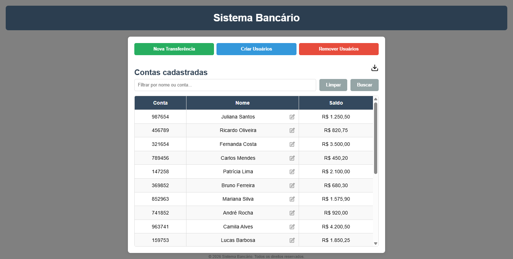

# 🏦 Sistema Bancário

Sistema de gerenciamento de contas bancárias com **operações CRUD completas**.

**Recursos principais:** filtragem e busca por nome/conta, interface responsiva (desktop e mobile), dropdowns customizados, validações em tempo real, e exportação de relatórios em **3 formatos** (CSV, Excel, PDF).

---

## 📸 Demonstração

---

## 🛠️ Tecnologias Utilizadas

- **HTML5** | **CSS3** | **JavaScript (ES6+)**
- **LocalStorage API** - Persistência de dados
- **DOM Manipulation** - Manipulação dinâmica de elementos
- **Event Delegation** - Gerenciamento eficiente de eventos

---

## 📚 Bibliotecas Externas (via CDN)

- SheetJS (v0.20.1) - Exportação para Excel
- jsPDF (v2.5.1) - Geração de PDFs
- jsPDF AutoTable (v3.5.31) - Tabelas em PDF

---

## 📄 Licença

Este projeto está sob a licença MIT. Sinta-se livre para usar, modificar e distribuir.

---

  © 2026 Sistema Bancário. Todos os direitos reservados.

